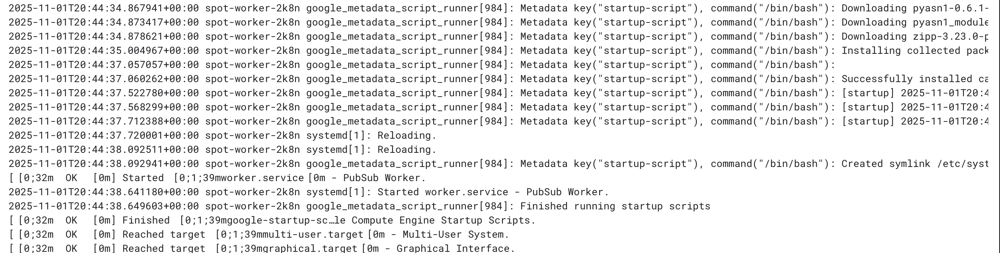
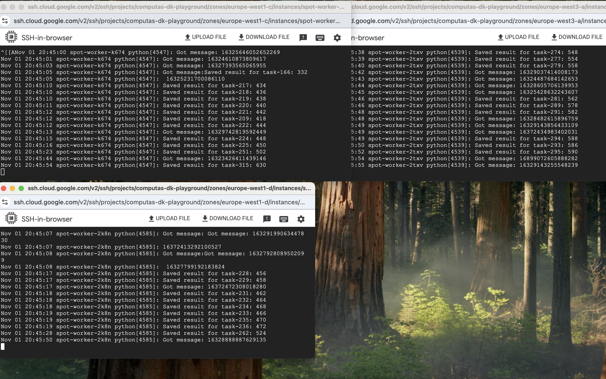
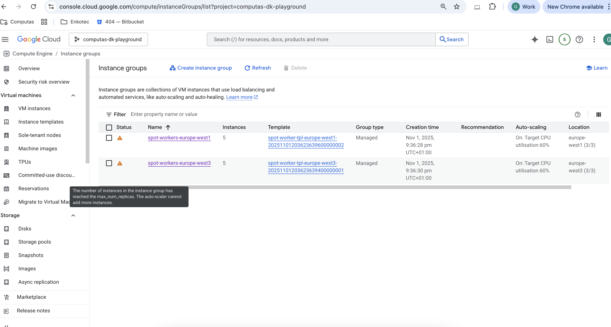
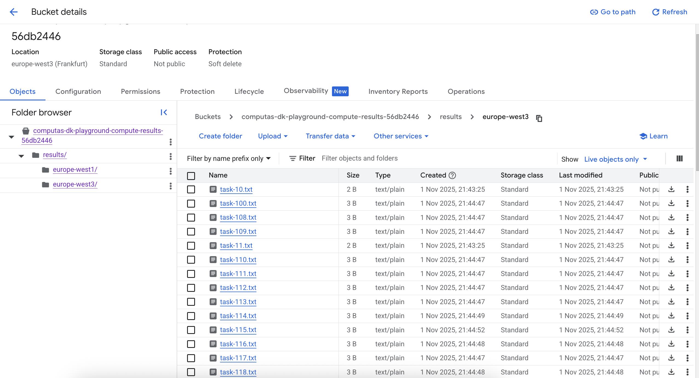

# Multi-region MIG pull subscription

This example creates Managed Instance Groups in multiple GCP regions, and makes them use the same PubSub pull subscription in orther to distribute tasks among themselves.

## Design

The repo has two important folders
- terraform: for the infrastructure
- scripts: the non-terraform parts

### Terraform

- iam.tf: The MIGs' service account + permissions
- io.tf: The pubsub channel and the output bucket
- main.tf: MIG definition
- network.tf: firewall and network setup so we can ssh to the machines for debugging
- output.tf: terraform outputs
- providers.tf: importing the google provider
- services.tf: enabling google APIs
- variables.tf: terraform variables, most of them with default values

### Scripts

This is a hack to get some code on the machines, in prod this should be some container + git based workflow.

#### worker.py

The calculation is just some dummy python stuff which
- pulls a message from a pubsub topic
- runs some CPU heavy calculation to simulate the real behavior
- writes some result to a bucket


## Install

Clone the repo and chdir into it. First, initialize gcloud, if you haven't done so:

```bash
gcloud auth login
```

Then let's create our tfvars file, and set the correct project_id in it. Choose a project where you have **Owner** role.

```bash
cp project_vars/templatevars project_vars/common.tfvars
```

Time to build

```bash
terraform apply -var auth_token=$(gcloud auth print-access-token) --var-file project_vars/common.tfvars
```

Things might break because some APIs might not be enabled (I haven't tested on a newly created). Extend services.tf accordingly and re-run.

If apply keeps breaking, the best might be to destroy it and start from scratch

```bash
terraform destroy -var auth_token=$(gcloud auth print-access-token) --var-file project_vars/common.tfvars
```

### Initial checks

Go to Instance Groups in the console, and from there to a vm. Check serial logs to see if the startup script finished without errors



If so, ssh to the machine, and run 

```bash
sudo journalctl -u worker -f
```

so we can see the logs of our worker. Do the same with the first vm of other instance groups as well.

## Test

From our own machine (so not the VMs) we c

```bash
terraform % for i in {1..500}; do \                                                                                
  gcloud pubsub topics publish compute-tasks \
    --message "{\"task_id\":\"task-$i\",\"input\":$i}" \
    --project computas-dk-playground; \
done
```

It should produce output like

```
...
messageIds:
- '16327832719444910'
messageIds:
- '16325135505602660'
messageIds:
- '16329483208811881'
...
```

and if we look at the VM terminals, we should see them eating the messages:



And after a few seconds, when restarting the Instance Groups page in the console we should see scaling happenning.



And we should also see results in all the folders of the results bucket



## Cleanup

Delete everything from the results bucket if you want terraform to also destroy it. Then destroy the rest:

```bash
terraform destroy -var auth_token=$(gcloud auth print-access-token) --var-file project_vars/common.tfvars
```

## Closing thoughts (no specific order)

- This is of course not a silver bullet of any kind, just a simple example of one way of multi-region scaling
- We can go crazy with scaling metrics, it doesn't have to be the CPU utilization
- I have no clue what happens if there's not a single available spot instance in a region
- Pubsub messages can be max 10MB which sounds suitable for the DPI, but might be insufficient for other stuff
- Using regional templates would have been a more semantically correct approach then defining a global one for every region
- It would be an obvious improvement to do this with container optimized os instead of copying code from a bucket
- And again: this is just a POC
